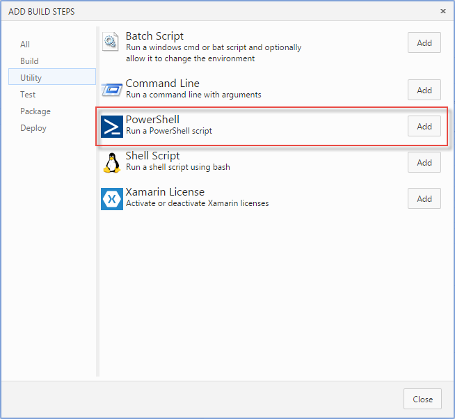
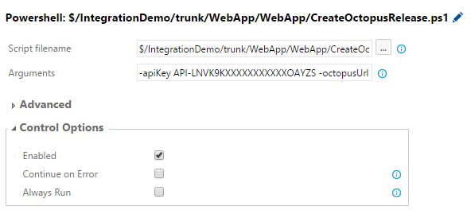

Build PowerShell Scripts
========================

PowerShell Scripts that can be used independently or with [Team Build vNext](http://vsalmdocs.azurewebsites.net/library/vs/alm/build/overview)

[Create Octopus Release](CreateOctopusRelease.ps1)
----------------------
Creates a new Release in Octopus Deploy.

### Instructions for use with Team Build vNext:

1. Include the `CreateOctopusRelease.ps1` file in your project or solution

2. Add the *PowerShell* build step to your build definition.

 

3. Set the *Script filename* field by locating the `CreateOctopusRelease.ps1` file in your repository  

4. Set the following parameters in the *Arguments* field:

 `-apiKey API-LNVK9KXXXXXXXXXXXOAYZS -octopusUrl http://my-octopus-server -octopusProjectId projects-1`

 * **`-apiKey`** - Your API Key (See [documentation](http://docs.octopusdeploy.com/display/OD/How+to+create+an+API+key) for details on how to create an API Key)
 * **`-octopusUrl`** - The URL that points to your Octopus Deploy server
 * **`-octopusProjectId`** - The Id of the project you want to create a release for
 
 