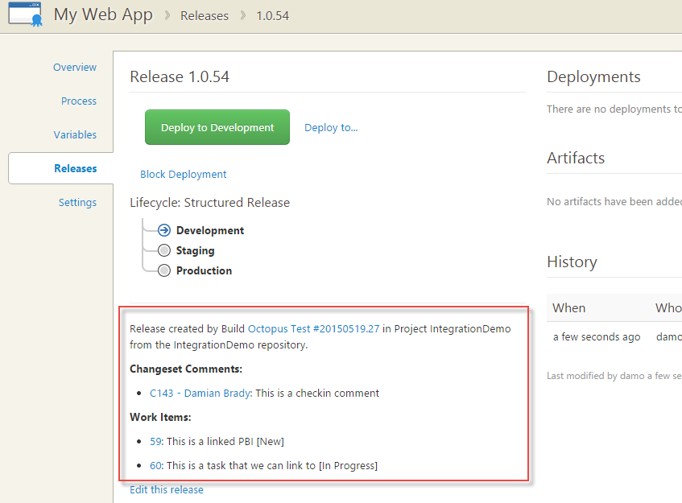

Team Build Preview Custom Steps
===============================

Custom Build Steps for [Team Build vNext](http://vsalmdocs.azurewebsites.net/library/vs/alm/build/overview)

These need to be uploaded to your Visual Studio or TFS instance before they can be used. To upload this custom task, use the `tfs-cli` tool available from [https://www.npmjs.com/package/tfx-cli](https://github.com/Microsoft/tfs-cli).

*Note: You can still use [OctoPack](http://docs.octopusdeploy.com/display/OD/Using+OctoPack) as part of your MSBuild task to package and push Nuget packages.*

[Create Octopus Release](CreateOctopusRelease)
----------------------
Creates a new Release in Octopus Deploy.

### Instructions for use:

1. Upload the `CreateOctopusRelease` custom build task (*Note: not currently available)*

2. Add a Generic *Connected Service* in the Administration page for your Team Project.

 
 
 
 
 *Note: Currently, you should just put an [API key](http://docs.octopusdeploy.com/display/OD/How+to+create+an+API+key) in the password field. We'll add user/pass soon and work out which one you're using.*
 
3. Add the *Create Octopus Release* custom build step to your build definition.

 
 
4. Configure the custom build step.

 
 
 Options include:
 * **Octopus Deploy Server**:  Dropdown for selecting your Octopus Server (step 1)
 * **Project Name**:  The name of the project to create a release for
 * **Include Changeset comments**:  Whether to include changeset comments in the release notes
 * **Include Work Items**:  Whether to include work item titles in the release notes
 * **Deploy Release To**:  Optional environment to automatically deploy to (uses the [`--deployTo` argument in octo.exe](http://docs.octopusdeploy.com/display/OD/Creating+releases))
 * **Additional Octo.exe Arguments**:  Any additional [Octo.exe arguments](http://docs.octopusdeploy.com/display/OD/Creating+releases) to include
 
### Release Notes:

The *Release Notes* options, if selected, will result in nicely formatted release notes with deep links to Team Foundation Server or Visual Studio Online.

